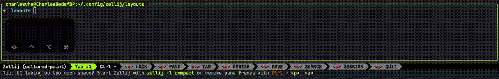

# copy zellij-0.36.0/default-plugins/ status-bar+tab-bar
# 编译wasm
debug `cargo build --target wasm32-wasi`

release `cargo build -r --target wasm32-wasi`

# 添加测试配置 ~/.config/zellij/layouts/stb.kdl
```
plugins {
    status-tab-bar { path "/Volumes/DATA/VSCodeProjects/zellij-status-tab-bar/target/wasm32-wasi/debug/zellij-status-tab-bar"; }
}

layout {
    pane
    pane size=2 borderless=true {
        plugin location="zellij:status-tab-bar"
    }
}
```
# 测试 zellij -l stb

